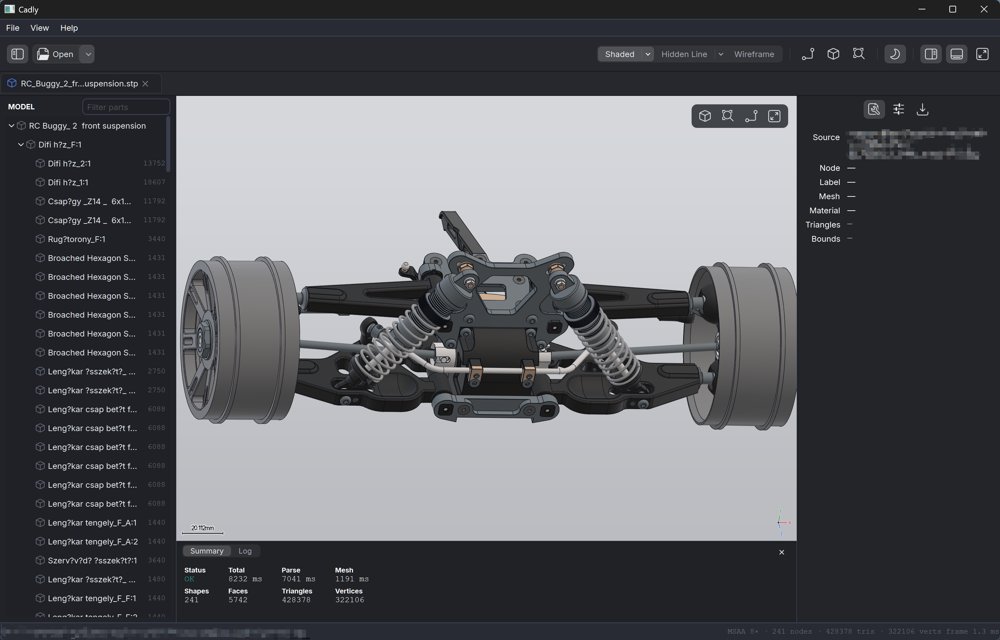
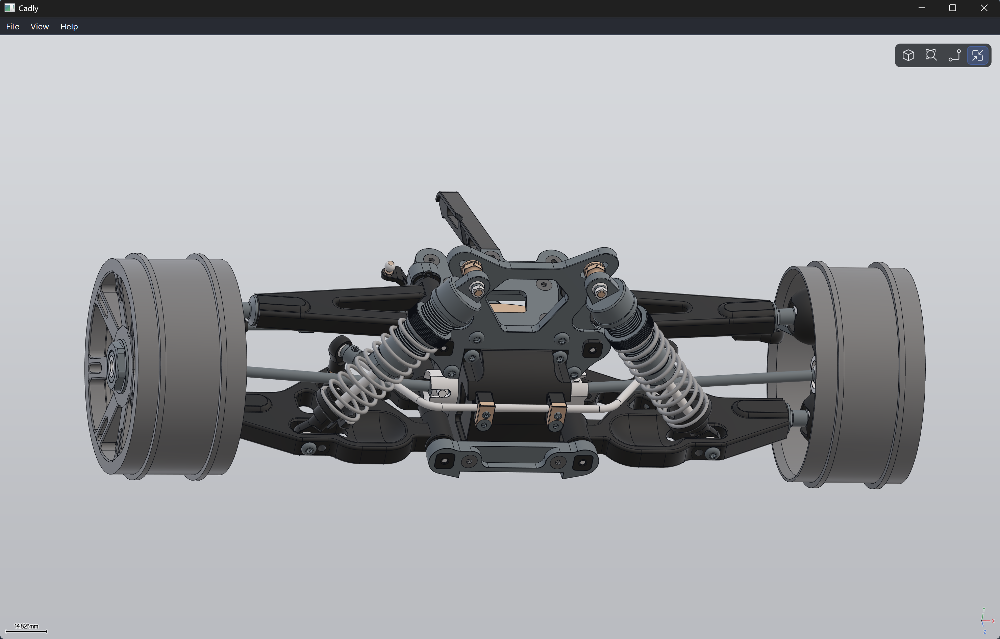
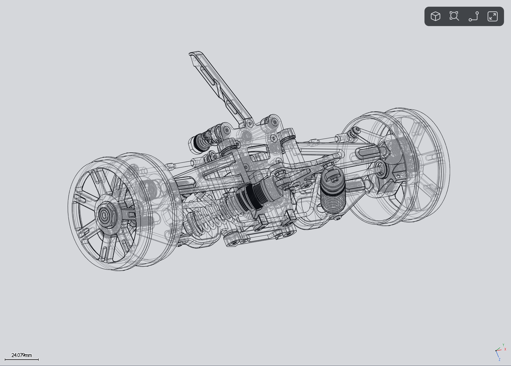

# Cadly

> A simple CAD model import and viewing tool — open a STEP/IGES file and inspect it.

[](LICENSE)

[中文文档](README.zh-CN.md)

Cadly is a native C++17 desktop CAD **viewer** (not an editor). It imports
STEP/IGES through Open CASCADE (OCCT), triangulates the B-Rep, and draws it with
a hand-written real-time renderer (OpenGL 4.1 core; the interface is built to
take a Vulkan backend later). Qt 6 Widgets provides the shell. Materials are PBR
metallic-roughness with image-based lighting, tuned for industrial inspection.



<table>
<tr>
<td width="50%"></td>
<td width="50%"></td>
</tr>
<tr>
<td align="center"><sub>Zero-chrome mode — panels hidden (<code>⌃.</code>)</sub></td>
<td align="center"><sub>Wireframe, with silhouettes generated per frame on the GPU</sub></td>
</tr>
</table>


## Features

- **Import** STEP and IGES via OCCT CAF readers — colors, names, and assembly
  hierarchy preserved, with geometry-only fallback readers.
- **Non-modal import** on a worker thread: progress and cancel live in the
  document tab, and the previous scene stays interactive throughout.
- **Display modes** — shaded, shaded with edges, hidden line (with optional
  dimmed hidden lines), wireframe with an analytical LOD edge ladder, and a
  triangle-mesh debug overlay. View-dependent silhouette contours are generated
  on the GPU for the line modes.
- **CAD-style navigation** — right-drag orbits, middle-drag pans, cursor-anchored
  wheel zoom, orthographic by default, standard views on `1`–`7`.
- **Assembly tree** with selection highlight and double-click isolate (ghost or
  hide the rest).
- **Tabbed documents**, an inspector with persistent import options (meshing
  deflection, healing, welding), dark/light themes, and a zero-chrome mode.
- **Localized UI** — English and Simplified Chinese.
- **Headless CLI** (`cad_import_cli`) for validating imports without a display.

## Build & run

CMake presets (Ninja), using prebuilt Qt 6 + OCCT from apt on Linux,
MSYS2 UCRT64 on Windows, and Homebrew on macOS.

```bash
cmake --preset linux-release          # configure (RelWithDebInfo)
cmake --build --preset linux-release  # build -> build/linux-release/bin/
ctest   --preset linux-release        # smoke tests

build/linux-release/bin/cadly [file.step]        # GUI; optional file opens at startup
build/linux-release/bin/cad_import_cli file.step # headless import, prints geo stats
```

On Windows, install [MSYS2](https://www.msys2.org/) and open its **UCRT64**
terminal. Run `pacman -Syu` first; if asked to close the terminal, reopen it
and repeat the update. From the repository root:

```bash
bash scripts/setup-windows.sh        # install binary packages, including GCC
cmake --preset windows-msys2-release
cmake --build --preset windows-msys2-release
ctest --preset windows-msys2-release
build/windows-msys2-release/bin/cadly.exe [file.step]
```

Windows CI uses these same packages and commands, without building Qt/OCCT
from source or maintaining a dependency binary cache. Packages track the
MSYS2 repository; GCC and all libraries must come from UCRT64. The distributed
app includes its runtime DLLs and runs without MSYS2 installed.

Other presets: `linux-debug`, `linux-qt68-{debug,release}` (Qt 6.8 with the
qlementine style), `windows-msys2-debug`, and `macos-{debug,release}` (run
`scripts/setup-macos.sh` first). Optional vcpkg presets remain available:
`linux-vcpkg-debug`, `windows-msvc-{debug,release}` (VS solution), and
`windows-ninja-{debug,release}` (MSVC from the environment). CI builds, tests,
and packages on all three platforms; `v*` tags publish those packages on the
[Releases](../../releases) page.

### Requirements

- C++17 compiler, CMake ≥ 3.24, Ninja
- Qt 6 (Widgets, OpenGL, Concurrent, Svg; LinguistTools optional)
- Open CASCADE 7.6+
- glm, spdlog, fmt
- A GPU/driver with OpenGL 4.1 core

## Architecture

One CMake target per module under `src/`, exported as `Cadly::<Name>`:

| Module | Target | Role |
|---|---|---|
| `platform` | `Cadly::Platform` | logging, asset/path lookup |
| `scene` | `Cadly::Scene` | canonical model — glm only, no Qt/OCCT/GL |
| `renderer` | `Cadly::Renderer` | `IRenderer` / `RenderTypes` interface |
| `renderer_gl` | `Cadly::RendererGL` | OpenGL 4.1 backend, Qt-free |
| `cad` | `Cadly::Cad` | importers — the only target linking OCCT |
| `ui` | `Cadly::Ui` | widgets, viewport host |
| `app` | `cadly` | entry point, settings, recent files |

Data flow: file → `ImporterRegistry::select()` → OCCT STEP/IGES importer →
`BRepMesh_IncrementalMesh` → `scene::Mesh` → `scene::Scene` →
`IRenderer::attach_scene()` → `render()`.

`docs/cad-viewer-plan.md` holds the original design plan and milestone map;
`docs/ui-redesign/` documents the shell layout. `CLAUDE.md` describes the
invariants to preserve when changing the code.

## License

Licensed under the Apache License, Version 2.0 — see [LICENSE](LICENSE).

Cadly links Open CASCADE (LGPL-2.1 with an exception) and Qt 6 (LGPL-3.0); those
components remain under their own licenses.
