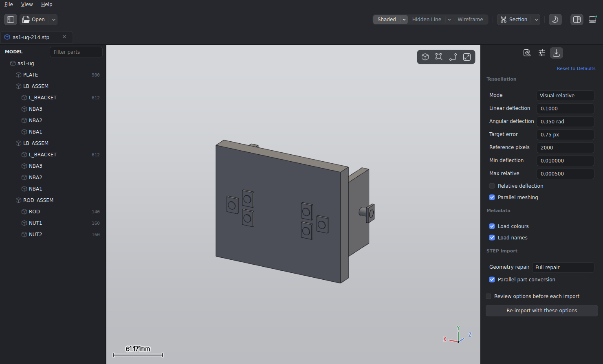

# STEP 读取与 OCCT 转换深度性能分析

日期：2026-09-10。基线为 Cadly `b59544c`，对照为本次工作树。

本次已经修改导入器和两个 OCCT toolkit，保留默认完整几何修复，补充了输出对照、
取消、部署和 GUI 首帧验证。**仍未证明 RC 模型能够稳定在 1–2 秒内首次打开。**
不能把一次最快的 CLI 数据写成 GUI 秒开，也不能用缓存命中冒充首次 STEP 转换。
本机最终 RC 完整导入中位数从 **27.35 秒降到 15.28 秒**，显式快速模式为
**12.71 秒**；GUI 首帧分别为 **26.04 / 20.91 秒**。具体边界和限制见下文。

## 测试环境与完成定义

当前机器是 Intel Core i5-10210U，4 核 8 线程、7.7 GiB 内存、WSL2，
Qt 6.4.2、共享版 OCCT 7.6.3；Release preset 实际为 `RelWithDebInfo`。
GUI 通过 Mesa 25.2.8 / D3D12 使用 NVIDIA GeForce MX350。

[旧报告](02-import-performance-occt-vs-commercial.md) 使用 Ryzen 5 7500F、6 核
12 线程、15 GiB 内存以及 Debug preset。旧报告记录 RC 为约 11 秒、231 MB 模型
为约 98 秒；这些数字不能直接作为当前机器的优化前后对照。当前基线也未重现
“RC 每次需要数分钟”，但 231 MB 模型可以重现分钟级导入。

| 输入 | 文件字节数 | OCCT 实体 | 唯一 mesh | 节点 | 面 |
| --- | ---: | ---: | ---: | ---: | ---: |
| `RC_Buggy_2_front_suspension.stp` | 15,257,496 | 220,769 | 91 | 241 | 5,742 |
| `3864470050F1.stp` | 231,299,236 | 2,782,135 | 315 | 720 | 60,185 |

全部对照使用相同 visual-relative 网格设置：0.75 px、2000 reference pixels、
0.35 rad 角度偏差。RC 的实际线性偏差为 0.111783 mm。没有模型缓存，没有降低
这些网格精度参数，也没有关闭默认的名称、颜色和装配读取。

- CLI `total time`：读取、B-Rep/XCAF 转换、三角化和 scene 抽取完成。
- CLI `wall time (including cleanup)`：还包括 reader、transfer map 和 XCAF document
  析构；不含随后打印指纹和进程退出的时间。
- `/usr/bin/time`：完整进程，包括上述工作、诊断打印和退出。
- GUI `--profile-import`：从调用 `open_file` 到新 scene 的 `render` 完成并收到
  Qt `frameSwapped`；包含真实 GPU 上传和首次绘制。它不包含此前的进程启动和
  GL context 初始化，也不等于显示器物理扫描完成。

各次 CLI 是新进程，按原版/优化版交替执行，没有并行跑多个大文件，也没有同时编译。
文件通常已在操作系统页缓存中；未清除系统缓存，不能称为冷磁盘测试。WSL/宿主机
频率和外部负载没有锁定，实测波动明显，因此保留重复数据和范围。

## CPU 时间实际花在哪里

### 1. ReadFile 主要是解析，不是磁盘带宽

单纯读完文件，本机 RC 约 0.011 秒，231 MB 模型约 0.283 秒；这只代表当时页缓存
条件下的字节读取，不包含 STEP 语义解析。

原版 231 MB 输入的 CPU 采样中，lexer/parser 路径占约 61.1%。OCCT 7.6.3 的
`StepFile/lex.step.cxx` 定义了 `YY_INTERACTIVE`，C++ flex reader 因而走逐字节
输入路径，并反复重建 scanner 状态。换成 `ifstream`、mmap 或提高磁盘速度都没有
直接解决这段计算。

补丁在 `step.lex` 明确使用 `%option batch`，同步修正已生成的 scanner。
仍由 OCCT 的 STEP parser 处理 token、引用、单位和产品结构，不另写一套简化解析器。
保留了跨输入 refill 的长名称、双单引号和长注释回归测试。

OCCT 7.6 scanner 原有的单 token 约 16 KiB 限制仍在：它使用需要 `REJECT`
支持的规则，不能动态增长这个缓冲区。超过该限制的单个字符串在系统原版和补丁版
均会失败；测试跨多次读取，但不声称扩展了该格式限制。

### 2. Transfer 的主要成本是构造和修复几何

仅把 STEP 实体变成 `TopoDS_Shape` 并不是全部工作。默认路径还建立 pcurve、缝线、
修复 wire、投影曲线、检查相邻边交叉，并合并 XCAF 的装配和属性。

RC 中一个 138 面零件占了很长的修复时间。调用栈进入
`ShapeFix_Wire::FixIntersectingEdges`、二维曲线求交以及
`Intf_InterferencePolygon2d`。原算法对两条采样折线的线段做嵌套遍历，反复建立包围盒。
即便最终没有交点，也可能检查大量线段对。

精确优化分两部分：

1. 对第二条折线建立扩张包围盒的空间索引，筛出候选线段。候选编号排序后，按照
   原算法相同的顺序调用 `Intersect`。自交路径同样使用索引，小输入保留原循环。
2. `Intersect` 中最多几个临时交点使用栈上固定容量存储，避免每对线段都创建
   `NCollection_Sequence`、访问共享 allocator、分配节点和遍历链表。

原来的浮点求交、容差、交点去重和切触区合并规则都保留。测试把固定版本的原始源码
改名后编译进同一个程序，对随机曲线、重叠、切触、退化线段、闭合/非闭合、不同
容差和索引阈值逐项比较交点、参数、顺序和切触区。

空间索引之后再次采样，`Intersect` 自身仍占约 7% CPU，序列查找约 4.4%，
引用计数增减合计约 6.5%；这些是采样 CPU 比例，不能直接当作 wall time 比例。
栈上存储的隔离零件 A/B 修复结果为：修改前 9.57 / 7.99 秒，修改后 7.25 / 6.58 秒。
完整导入的单次 A/B 波动更大，不能据此承诺固定百分比收益。

### 3. 独立零件转换可以并行，但共享 reader 不可以

新路径先收集独立的 manifold solid，每个任务拥有独立的 `STEPControl_ActorRead`、
`Transfer_TransientProcess`、修复上下文和结果。任务结束后串行合并 binder，再由
原来的 STEPCAF reader 生成装配、名称、颜色和其他 XCAF 属性。失败或不支持的
对象继续走普通 reader。

没有在同一个 reader 上并发调用 `TransferRoots`。以下情况会保守使用原路径：
共享 face/edge/wire/vertex、同一 body 出现在不同表示上下文、非流形转换设置、
不能安全并发的自定义 OCCT 修复序列等。曲线和点等只读输入可以共享。

OCCT 7.6/7.7 的单位因子是全局状态，因此先按长度/角度/立体角因子分组，每组全部
worker 退出后才切换下一组因子。7.8 以后使用任务自身的 `StepData_Factors`。
混合单位回归对照和真实大模型对照均用于检查此路径。

默认最多 4 个 worker，CLI 可设 1–64；1 表示普通串行转换。本机 RC 的一次完整修复
对照为串行 20.915 秒、8 worker 17.297 秒。8 worker 没有展示出明显优于 4 worker
的收益，不能把线程数等同于加速倍数。

STEP/IGES 导入入口共用可取消的进程内锁，保护 OCCT 的进程级配置和 XCAF 生命周期。
legacy 修复 provider 在退出、异常和取消时恢复；worker 先 join 再销毁 OCCT 数据。
`STEP healing work (sum)` 是各任务累计工作时间，存在重叠，不能再与总耗时相加。

### 4. 场景抽取还有重复工作

- 按唯一 prototype 组织一次批量三角化，避免装配中每个 located instance 重复进入
  mesher。装配尺寸仍从完整装配计算，重复实例继续共享 mesh。
- 颜色从已有 XCAF label 及其子 label 一次建立映射。旧的逐面
  `GetColor(TopoDS_Shape)` 会搜索装配，甚至为未着色的面创建 label，放大大模型成本。
- 保留面颜色、prototype 默认颜色和 instance override；颜色关闭时跳过颜色映射。
- 调整读取、转换、三角化、装配遍历的进度区间，避免首个 root 就报告 100%。

## 完整修复与快速查看



图中使用公开的 `as1-ug-214.stp` 示例，展示完整修复与独立零件并行转换选项。

**默认仍是 Full repair。** 可显式选择 `--step-healing fast`，或在导入选项中选择
“快速查看”。它仅跳过相邻边的交叉修复，保留其他处理和相同的网格精度。
这不是对任意坏模型都等价的开关；需要可靠的几何修复时使用 Full。

RC 的 full 与 fast 三角网格指纹相同，节点、材质、包围盒相同，但整场景指纹不同。
逐字段对照已把差异定位到 mesh index 33（从 0 计数）的三档解析边线；去掉边线后
场景指纹相同。进一步把每档边线还原为线段并按端点排序，**三个无向线段集合完全
一致**，即这个样本的差异是顶点/索引存储顺序。按相同数组下标计算坐标差会错误地
把重排当成几何偏移。该结论不保证其他输入关闭修复后也等价。

| RC 输出 | geometry hash | scene hash |
| --- | --- | --- |
| 新版 full，普通串行 | `97812ff574f64be1` | `89c7645a4b6435ec` |
| 新版 full，4 / 8 worker | `97812ff574f64be1` | `89c7645a4b6435ec` |
| 新版 fast | `97812ff574f64be1` | `d14cda389f2d7e34` |

prototype 三角化与旧的整装配三角化不是逐三角形等价：RC 从 414,758 三角形、
314,303 顶点变为 414,804 三角形、314,326 顶点。面、节点、mesh、材质数量和尺寸
一致，采用相同偏差。原版到新版的这一差异不能解释成丢失了 46 个面，也不能隐瞒。

大模型的新版串行和分组并行输出相同：geometry `621b9b1eba764704`、scene
`463dc73ce47b0e86`，3,264,202 三角形、2,510,676 顶点。源文件已有的两个无界面
诊断继续保留。隔离的慢零件在原有完整修复后也未通过全部 BRepCheck，不能声称
输入中所有坏几何已被修好。

## 实测记录

最终版本三轮交替复测，单位秒：

| 轮次 | 原版 | 默认完整修复 | 快速查看 |
| --- | ---: | ---: | ---: |
| 1 | 27.727 | 15.235 | 12.706 |
| 2 | 27.354 | 15.713 | 12.883 |
| 3 | 26.582 | 15.279 | 12.630 |
| 中位数 | **27.354** | **15.279** | **12.706** |

默认完整修复约 **1.79 倍**，快速查看约 **2.15 倍**。对应的完整进程时间中位数为
27.740 / 15.666 / 13.096 秒。下面是各阶段分别取中位数，不能把它们再次相加当作
同一轮总耗时：

| 阶段 | 原版 | 默认完整修复 | 快速查看 |
| --- | ---: | ---: | ---: |
| STEP ReadFile | 2.875 | 1.718 | 1.706 |
| STEP / XCAF Transfer | 18.672 | 9.244 | 6.695 |
| mesh / scene | 5.411 | 4.309 | 4.362 |

三轮新版 full 和 fast 分别保持上表中的相同输出指纹。峰值 RSS：原版
390,536–403,040 KiB，full 418,748–423,448 KiB，fast 420,296–431,072 KiB。

最终大模型完整修复：Read 21.537 秒、Transfer 101.078 秒、mesh/scene 40.921 秒，
导入 **163.540 秒**，完整进程 167.362 秒，峰值 RSS 3,639,980 KiB，输出指纹不变。
对最初 223.819 秒基线是约 1.37 倍；这里没有大模型的三轮同期对照，所以不把它
称为稳定中位数。仍未达到秒级完整导入。

最终 GUI 复测分别使用干净设置：

| 模式 | 场景准备好 | 首帧提交显示 | 两者差值 |
| --- | ---: | ---: | ---: |
| 默认完整修复 | 25.051 s | **26.037 s** | 0.986 s |
| 快速查看 | 19.977 s | **20.907 s** | 0.930 s |

这两次是单次 GUI 测量，均已捕获截图，不能当作 GUI 中位数。首帧仍明显慢于
CLI，不能声称 CLI 的 15.28 秒就是用户等待时间；当前数据没有把 GUI 导入期间的
额外耗时全部归因到某一个原因。
补充的 GUI CPU 采样（99 Hz）中，工作线程合计 90.17%、主线程 9.37%、图形驱动
线程 0.46%；主要热点仍是 OCCT 求交、引用计数、曲线计算和三角化。该采样运行的
首帧为 23.228 秒，包含采样扰动，不替换上面的普通运行结果。

### 较早记录与波动

基线首次三轮 RC 总耗时为 19.392 / 22.067 / 24.219 秒。后续交替测试整体变慢，
所以不能用不同时间段中各自最快的一次拼出加速倍数。

栈上临时存储改动前，连续三轮交替对照如下，单位秒：

| 轮次 | 原版 | 完整修复优化版 | 快速查看 |
| --- | ---: | ---: | ---: |
| 1 | 28.252 | 22.604 | 21.791 |
| 2 | 31.226 | 18.335 | 15.552 |
| 3 | 30.296 | 17.698 | 13.802 |
| 中位数 | 30.296 | 18.335 | 15.552 |

这一组完整修复约 1.65 倍、快速查看约 1.95 倍。早期独立实验的完整修复曾测到
7.214 秒导入、7.409 秒含清理，但后续没有稳定复现，不能作为验收数字。

231 MB 原版初始对照：Read 35.426 秒、Transfer 134.300 秒、mesh/scene 54.089 秒，
合计 223.819 秒，进程 227.35 秒，峰值 RSS 3,412,976 KiB。
分组并行的完整修复：Read 24.164 秒、Transfer 114.297 秒、mesh/scene 44.133 秒，
合计 182.599 秒，进程 186.63 秒，峰值 RSS 3,751,128 KiB。
292 个独立 body 参与预转换，其余对象继续普通路径。该组为单次、跨时间段对照，
且并行增加了内存，不能当作稳定吞吐量承诺。它仍然是分钟级。

首次 GUI 验证的完整修复为 29.305 秒首帧、28.101 秒场景准备，差值约 1.204 秒。
已实际检查截图，RC 装配和面板渲染完整。GUI 和 CLI 的计时边界、初始化负载不同，
报告分别列出。

## 构建、部署和复现

Linux + 共享版 OCCT **恰好 7.6.3** 时默认打开
`CADLY_OCCT_PERFORMANCE_PATCHES`。从官方 tag 下载源码并验证 SHA-256，在构建
目录重编译 `TKXSBase` 和 `TKGeomAlgo`，不替换系统安装。需要 `patch` 命令。
其他版本/平台默认关闭 toolkit 补丁，导入器侧优化仍可使用。

固定源码：
`https://codeload.github.com/Open-Cascade-SAS/OCCT/tar.gz/refs/tags/V7_6_3`。
SHA-256：`3f95808e2c5060c5b5001770b5e42c7d9a849b23d925272bc70a5a2377413aa9`。
已有源码可通过 CMake 的 `FETCHCONTENT_SOURCE_DIR_CADLY_OCCT763` 指定，适用于离线构建。

```bash
cmake --preset linux-release -DCADLY_OCCT_PERFORMANCE_PATCHES=ON
cmake --build --preset linux-release
ctest --preset linux-release
cmake --preset linux-debug -DCADLY_OCCT_PERFORMANCE_PATCHES=OFF
cmake --build --preset linux-debug
ctest --preset linux-debug
build/linux-release/bin/cad_import_cli \
  test_files/RC_Buggy_2_front_suspension.stp --profile --fingerprint
build/linux-release/bin/cad_import_cli \
  test_files/RC_Buggy_2_front_suspension.stp --profile --fingerprint --step-threads 1
build/linux-release/bin/cad_import_cli \
  test_files/RC_Buggy_2_front_suspension.stp --profile --fingerprint --step-healing fast
build/linux-release/bin/cadly \
  test_files/RC_Buggy_2_front_suspension.stp --profile-import --screenshot /tmp/rc-first-frame.png
build/linux-release/bin/cad_import_cli \
  test_files/as1-ug-214.stp test_files/KR600_R2830-4.stp test_files/bearing.iges --profile --fingerprint
build/linux-debug/bin/cad_import_cli \
  test_files/as1-ug-214.stp test_files/KR600_R2830-4.stp test_files/bearing.iges --profile --fingerprint
```

GUI 使用当前持久化导入设置。要控制对照，应通过临时 `XDG_CONFIG_HOME` 使用干净
设置，或明确在导入选项中选择模式。CLI 默认不会读取 GUI 设置。

```bash
perf record -e cpu-clock:u -F 199 --call-graph dwarf,8192 -o /tmp/cadly-step.data -- \
  build/linux-release/bin/cad_import_cli test_files/RC_Buggy_2_front_suspension.stp --profile
perf report -i /tmp/cadly-step.data --stdio --no-children -g none
ldd build/linux-release/bin/cad_import_cli
packaging/linux/package-portable.sh build/linux-release /tmp/cadly-portable
```

Linux 链接保证两个补丁库进入 executable 的依赖，使用 build RUNPATH 和安装后的
相对 RPATH；不依赖 `LD_PRELOAD`。旧系统库有 `-Bsymbolic-functions`，仅 preload
一个 scanner 函数的早期试验没有生效，不能作为优化证据。

便携打包从构建可执行文件解析依赖闭包，避免删除 staged `lib/` 后误复制系统原版库。
已经验证包内两份 toolkit 的 ELF build ID 与本次构建一致、与系统库不同，并运行
包内 CLI 导入公共 STEP。许可证、OCCT 例外条款和补丁一并安装。

## 验证与限制

- Release 使用 toolkit 补丁，18 项 CTest 通过。
- Debug 显式 `CADLY_OCCT_PERFORMANCE_PATCHES=OFF`，17 项 CTest 通过，覆盖系统库回退。
- 新测试覆盖装配实例共享、面/零件/实例颜色、跳过小面后的 face ID、颜色关闭、
  不新增 label、跨输入缓冲区、串并行一致性、混合单位和共享拓扑回退。
- 覆盖导入前取消、worker 内取消、等待全局锁时取消、取消后再次导入，检查 XCAF
  document 和 legacy provider 回收；STEP 后再导入生成的 IGES。
- 两种构建分别运行 `cad_import_cli` 导入 `as1-ug-214.stp`、`KR600_R2830-4.stp`
  和 `bearing.iges`，全部成功，几何和完整场景指纹逐输入一致。
- RC 在 3000 ms 发出转换中取消请求，3246 ms 返回，延迟 246 ms（包含清理）。
  ReadFile 本身没有进度取消接口，本次未改变读取阶段只能结束后响应取消的限制。
- OCCT 8.0 官方头文件的 importer/mesh/test **语法编译**通过；这不是 8.0 运行测试，
  也不是 Windows/macOS 运行验证。7.6.3 补丁不自动套用到新版内核。
- 测速日志、perf 数据和 CAD 派生截图留在本机临时目录。私有模型未加入版本控制。

## 距离稳定秒开还缺什么

这轮证明 ReadFile 和 Transfer 都能优化，但完整 STEP 语义解析、病态曲面修复和
全模型三角化仍有显著成本。增加线程、换 allocator、放宽输入精度都没有提供可以
直接承诺的数量级收益；放宽精度的试验还改变几何，未采用。

如果要求同一 STEP 首次打开、全部转换为 OCCT、相同修复和网格精度并在 1–2 秒
内完成，当前结果**没有达标**。进一步工作应以剩余热点为约束，而不是继续堆开关：

1. 针对慢零件的 pcurve 投影、wire 修复和细分曲线求交继续做算法级优化，并在同一
   公共回归集上比较完整几何结果。仅靠默认 reader 参数没有足够空间。
2. 若业务接受先显示，应建立明确的预览完成/完整 B-Rep 完成两个阶段，让独立零件
   逐批提交；首帧时间和全量完成时间分别报告。当前实现没有假装已经做到渐进导入。
3. 若要重复打开秒级，可缓存 scene 和精确几何，以源文件内容、OCCT/导入器版本、
   参数和完整性校验为键。这只改善再次打开，不解决首次转换，当前也未实现该缓存。
4. 与商业软件比较时，需固定同一个 STEP、首次/再次打开、实际完成定义和几何质量，
   在相同宿主环境记录首帧及全量完成。这里没有运行商业软件，不能推定它一定靠缓存，
   更不能声称本次已经追平。
