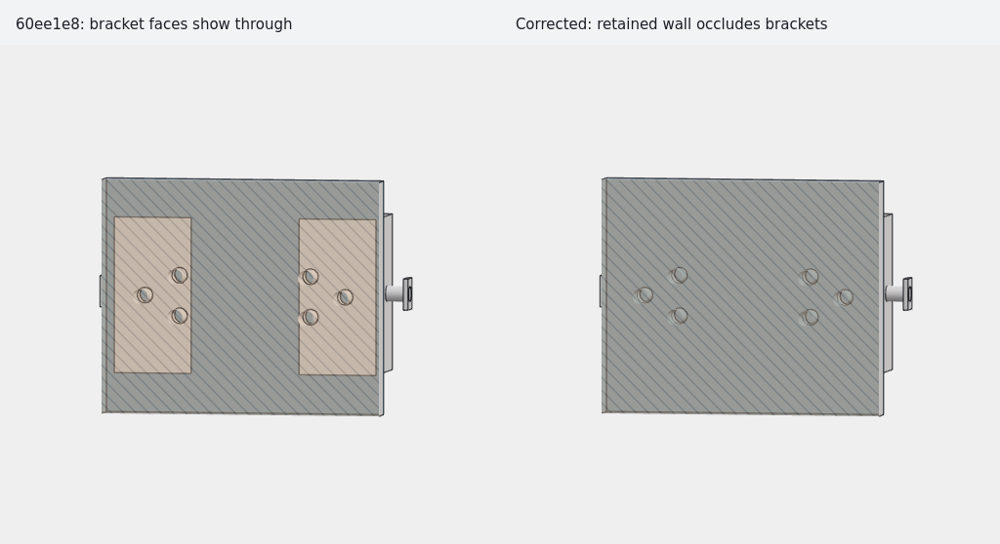

# 剖切旋转闪烁的定位与修复

2026-09-10，使用公共样例 `test_files/as1-ug-214.stp` 复现。

## 问题来源

截图中的主要冲突发生在底板与两个支架的接触面。`PLATE` 的 Z 范围为
0–20，两个 `L_BRACKET` 的底面也位于 Z=20。剖切穿过底板后，底板的背面
开始可见，与支架的正面处在同一深度。两侧三角化不同，尤其孔周围有细长
三角形，深度插值和 polygon offset 的舍入误差会随观察角度变化，导致两种
材质交替覆盖，表现为交错条纹和旋转闪烁。半透明剖切填充让这种冲突显现出来。

对公共样例的 18 个实体用 OCCT 检查：底板与每个支架的
`BRepAlgoAPI_Common` 交集体积均为 **0 mm³**，
`BRepExtrema_DistShapeShape` 最短距离均为 **0 mm**。
两个支架紧贴底板，没有穿入底板内部。

这不是 `05f013f` STEP 性能优化提交引入的。该提交没有修改 renderer、
renderer_gl 或 shaders；使用其父提交 `b59544c` 的渲染器也能复现相同条纹。
`b59544c` 开始显示被剖切打开的实体背面，从而暴露了这对接触面的冲突。

另外发现一处独立问题：`f4e8a8b` 将半透明填充移到边线之后绘制，但没有
恢复模型表面使用的深度偏移。当剖切面与已有表面重合时，旋转可能让填充
错误地覆盖该表面。这一问题也早于性能优化提交。

`60ee1e8` 用深度偏移消除了闪烁，但错误地让支架的正面优先于底板背面。
结果是灰色底板上出现两个稳定的矩形，看起来像支架穿透了底板。
正确的显示应当是：从剖开的底板内部看出去，底板保留部分的背面遮住
外侧贴合的支架。原先“正面优先”的测试预期也随本次修正一起更正。

## 修复方式

- 被剖切打开的零件分别绘制背面和正面。背面相对正面使用
  `factor=-0.25`、`units=-4` 的 polygon offset，让保留的底板背面
  稳定遮住外侧贴合的支架正面。
  随斜率变化的偏移用于覆盖细长三角形的舍入差异；只增加固定 units
  在真实样例的斜视角度下仍会留下条纹。
- 半透明剖切有边线覆盖时，把实体背面的绘制延后到普通边线之后，使它同时覆盖
  贴合零件的表面和边线。每个背面用 stencil 标记通过深度测试的像素，
  只在这些像素内重画该零件自己的边线，保留底板本身的轮廓和面边界。
  半透明填充随后重新生成它自己的 stencil，不共用此前的遮挡标记。
- 半透明填充恢复与模型表面一致的 polygon offset，绘制结束后关闭。
- 深度测试始终有效；真正伸入底板内侧、位于背面之前的几何仍然可见。

修改仅位于 Cadly 的 OpenGL 绘制阶段，没有修改 OCCT、模型顶点或拓扑。
剖切打开的零件分别提交正反面；半透明剖切有边线覆盖时额外维护背面的 stencil 并重画
对应零件的边线。分开剔除正反面的方式保留 GPU 的提前深度测试。
普通未剖切浏览和文件导入没有新增绘制或转换步骤。

## 验证

[`section_render_test.cpp`](../tests/section_render_test.cpp) 增加不经过 OCCT
的像素回归测试：已有表面遮住重合填充、保留的背面遮住贴合零件，以及
细长三角形和偏离原点的实例。其中接触面的预期已改为与“隐藏外侧零件，
只看保留背面”的参考图比较，同时检查外侧零件的矩形边线不能透出、
底板自己的面边界仍然可见，以及真实伸入 0.05 个模型单位的几何仍然可见。
覆盖正交／透视、MSAA 0／4、边线开关、镜像、绘制顺序和多个旋转角度，
同时保留原有空腔和遮挡测试。

```sh
cmake --build --preset linux-debug -j 2
build/linux-debug/tests/cadly_section_render_test -platform xcb
ctest --preset linux-debug
cmake --build --preset linux-release -j 2
build/linux-release/tests/cadly_section_render_test -platform xcb
ctest --preset linux-release
git diff --check
```

本次验证在 `refactor/input-navigation` 的独立 worktree 完成，性能分支
继续留在原工作区。Debug／Release 的 CTest 各 16 项全部通过；两个构建
另用 `-platform xcb` 显式运行桌面 OpenGL 像素测试，均通过。
修改的渲染器和测试没有新增编译警告；全量 Debug 构建仍有系统 OCCT
7.6 头文件的既有警告。图像验证使用 Mesa 25.2.8。

真实样例固定 Z=2 剖切、保留 Z≥2 一侧，分别在 0°、10°、35°、60°
观察角度检查每帧 48 个接触面采样点：修正后，显示／隐藏两个支架时，
这 48 个底板采样点在每个角度下均完全一致。`60ee1e8` 下同样对比则
分别有 48、48、42、35 个采样点受到支架影响。
下图使用相同的导入器、模型、剖切参数和相机，左侧是 `60ee1e8` 的
错误遮挡结果，右侧是修正后的结果。


